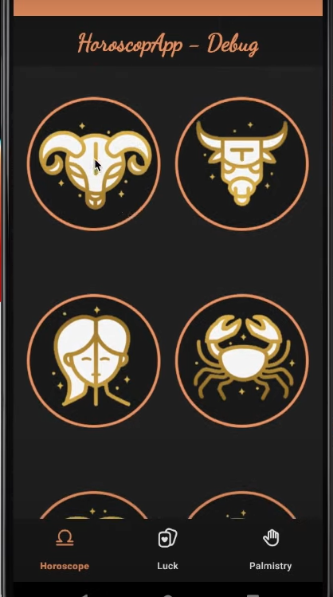

# Proyecto de Desarrollo de Aplicaciones Android con Kotlin

Este repositorio contiene el código fuente y los recursos utilizados en el Curso Intermedio de Desarrollo de Aplicaciones Android con Kotlin. Durante este curso, hemos explorado conceptos y técnicas avanzadas que te ayudarán a llevar tus habilidades de desarrollo de aplicaciones Android al siguiente nivel.



## Características Destacadas

- Implementación de una arquitectura de aplicaciones MVVM.
- Integración de servicios y API externos para enriquecer las funcionalidades de la aplicación.
- Implementación de patrones de diseño avanzados para una estructura de código más clara y mantenible.
- Desarrollo de interfaces de usuario atractivas y receptivas que brindan una experiencia de usuario excepcional.
- Pruebas y depuración de aplicaciones para garantizar su calidad y fiabilidad.
- Trabajar de forma eficiente con git y gitFlow
- Inyeccion de dependecias Dagger Hilt
- Retrofit avanzado
- Diseño avanzado
- Testing

## Cómo Ejecutar el Proyecto

Para ejecutar este proyecto en tu máquina local, sigue estos pasos:

1. Clona este repositorio en tu máquina local:

   ```bash
   git clone https://github.com/Felipebastidas1105/curso-android-intermedio.git
2. Abre Android Studio en tu máquina.

3. En Android Studio, selecciona "File" (Archivo) en el menú superior y elige "Open" (Abrir).

4. Navega hasta el directorio donde clonaste el repositorio y selecciona el proyecto.

5. Espera a que Android Studio cargue el proyecto y sincronice las dependencias.

6. Luego, puedes compilar y ejecutar la aplicación en un emulador de Android o en un dispositivo físico.

# NOTA
Asegúrate de tener instalado Android Studio y configurado un emulador o un dispositivo Android físico para ejecutar la aplicación. Además, verifica que todas las dependencias y configuraciones del proyecto se hayan sincronizado correctamente.

Este repositorio está diseñado para ayudarte a practicar y aplicar los conceptos aprendidos en el curso intermedio de desarrollo de aplicaciones Android con Kotlin